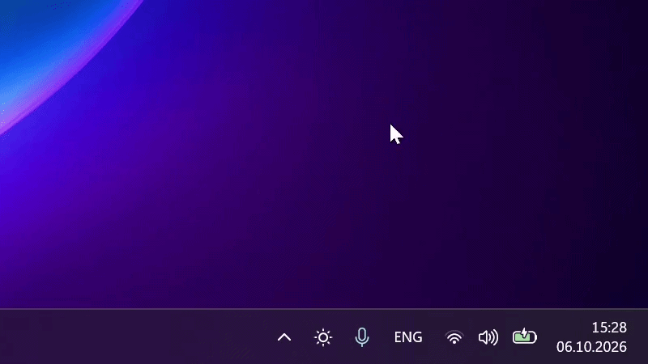
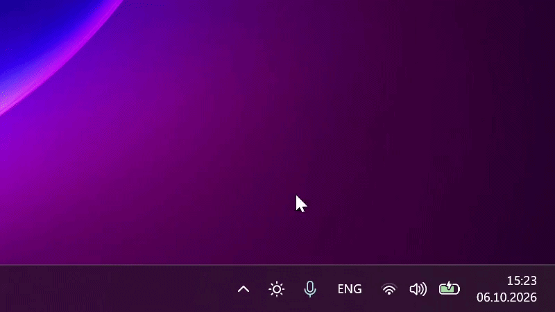
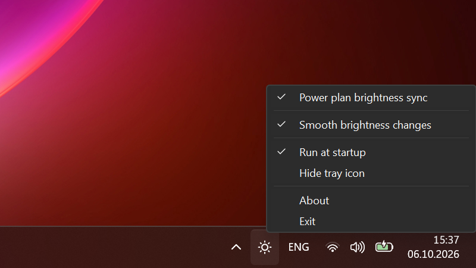
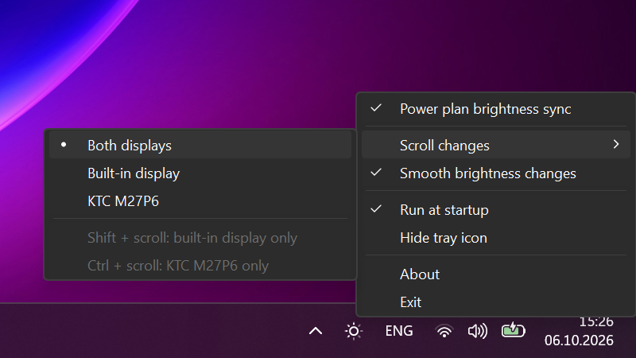

# Brightness Sync

A tiny Windows tray utility for laptop and monitor brightness:

- **Same brightness in every power plan.** Switching power modes (e.g. Armoury Crate Silent / Turbo) no longer changes your brightness.
- **Scroll over the tray icon** to change the brightness, smoothly or instantly.
- **External monitors too.** One scroll adjusts the laptop and external monitors (over DDC/CI) and keeps the difference between them.
- **Lightweight.** A single ~100 KB exe that starts instantly and uses ~5–9 MB of RAM. No installer, no background services, no Electron.

| Laptop | Laptop + external monitor |
|:---:|:---:|
|  |  |

## The problem

Windows stores display brightness separately for every power plan. Laptop vendor tools such as ASUS Armoury Crate switch power plans when you change the operating mode (Silent / Performance / Turbo), and every switch restores that plan's own brightness. The result: you set 50%, switch to Silent, and the screen jumps to 20%.

Brightness Sync listens for brightness changes and writes the current level into every power plan, so all modes share one brightness.

## Features

- Brightness stays put when you switch power modes
- Picks up power plans created later (e.g. after reinstalling Armoury Crate)
- Restores your level if a vendor tool overwrites a plan's brightness
- Scroll over the tray icon to change the brightness, smoothly or instantly
- External monitors (DDC/CI): one scroll changes all displays and keeps the difference between them
- Windows 11 style tray icon that shows the brightness level and follows the light or dark taskbar
- Tray menu and About window that follow the Windows theme
- Run at startup without UAC prompts (via Task Scheduler)
- Hidden mode: hide the tray icon, run the app again to bring it back
- Single instance, event-driven (no polling), ~100 KB exe, 5–9 MB RAM, no dependencies beyond .NET Framework

## Requirements

- Windows 10 or 11
- .NET Framework 4.5 or newer (preinstalled on Windows 10/11)
- Power plan sync: a laptop with a built-in display. Windows keeps a separate brightness per power plan only for built-in panels, so external monitors don't need it
- External monitors: DDC/CI support, usually a setting in the monitor's own menu. Scrolling works for them on desktop PCs too
- Administrator rights (power plans can only be modified by an admin)

## Install

### winget

> The winget package is under review. Until it appears, use the [manual install](#manual).

```
winget install Yukhnevich.BrightnessSync
```

Then start it: press **Win+R**, type `brightnesssync` and press Enter (or run `brightnesssync` in a terminal).

### Manual

Download `BrightnessSync.exe` from [Releases](https://github.com/Yukhnevich/BrightnessSync/releases) and put it wherever you want to keep it, e.g. `C:\Tools`.

> The exe is not code-signed, so Windows SmartScreen may warn on first launch. Click **More info → Run anyway**, or build it yourself from source.

## Getting started

1. Start the app and confirm the UAC prompt (only needed the first time).
2. Click the sun icon in the tray and enable **Run at startup**.

That's it. From now on it starts at logon with admin rights and no UAC prompt.

### Tray icon

The sun's rays show the current brightness in five steps: all rays are gray below 20%, lit as dots from 20%, and grow with every next 20% until they are full at 80% and above. The ring turns gray while power plan sync is off.

With the built-in display and an external monitor the sun is split the way *Settings > Display* arranges them: side by side, each display gets the rays on its side, the top ray shows the main display and the bottom ray the other one. When the monitor sits above or below the laptop, the sun is split into upper and lower halves instead, and the left ray shows the main display.

Hover over the icon to see the brightness and whether power plan sync is on. Scroll over it to change the brightness: on the built-in display one notch moves to the next level your display supports, or by 5% if it supports every percent.

### External monitors

Monitors that support DDC/CI (most do, over HDMI, DisplayPort and USB-C) are picked up automatically and listed in the tooltip:

```
Built-in display: 50%
KTC M27P6: 70%
Power plan brightness sync: on
```

Scrolling changes all displays by the same step, 2% per notch, and keeps the difference between them. The built-in display follows on the nearest level it supports. If one display reaches 0% or 100% first, it waits there while the others keep going, and on the way back they catch up, so 30% and 60% become 30% and 60% again. With **Smooth brightness changes** on, monitors glide to the new level as well.

Choose what scrolling changes in **Scroll changes** in the tray menu (both displays by default; the choice is remembered), or hold a key for a single scroll:

| While scrolling | Changes |
|---|---|
| no key | what **Scroll changes** is set to |
| **Shift** | only the built-in display |
| **Ctrl** | only external monitors |

Changing one kind of display on its own sets the new difference. Changes made elsewhere (Fn keys, the Windows slider, the monitor's buttons) are picked up the next time you hover over the icon.

When the built-in display is off (lid closed, or *Second screen only* in **Win+P**), scrolling changes only the external monitors.

### Tray menu

| Laptop | Laptop + external monitor |
|:---:|:---:|
|  |  |

| Item | Action |
|---|---|
| **Power plan brightness sync** | Keep one brightness for the built-in display in all power plans. Turn off to let every plan keep its own brightness again |
| **Scroll changes** | With an external monitor: what scrolling changes, both displays, the built-in display or the monitor |
| **Smooth brightness changes** | When scrolling, glide through the levels in between. Turn off to jump to the new level instantly |
| **Run at startup** | Create or remove the scheduled task that starts the app at logon |
| **Hide tray icon** | Hide the icon; sync keeps running |
| **About** | Version, tips, the log location and a link to this page |
| **Exit** | Quit the app |

### Launching the app again

Launching the app while it is already running does not start a second copy. Instead, the running instance shows its tray icon and enables sync. This is how you bring back a hidden icon.

If the app is not running and the startup task exists, it starts through the task, without a UAC prompt.

### Command line

| Command | Behavior |
|---|---|
| `brightnesssync` | Show the tray icon and enable sync |
| `brightnesssync /autostart` | Start with saved settings (used by the startup task) |

## Update

Quit the app first (tray → **Exit**), because Windows does not allow replacing a running exe:

```
winget upgrade Yukhnevich.BrightnessSync
```

Then start it again. The startup task keeps working: winget installs every version to the same folder.

## Uninstall

1. Uncheck **Run at startup** in the tray menu, then choose **Exit**.
2. Remove the app: `winget uninstall Yukhnevich.BrightnessSync` (or delete the exe if installed manually).
3. Optionally remove settings and logs:
   ```bat
   reg delete HKCU\Software\BrightnessSync /f
   del "%LOCALAPPDATA%\BrightnessSync.log*"
   ```

Brightness values already written to your power plans stay equal; this is harmless.

## How it works

- Listens to `WmiMonitorBrightnessEvent` (WMI) for brightness changes from the slider or Fn keys.
- After the slider settles (1 s), writes the level into every power plan via `PowerWriteACValueIndex` / `PowerWriteDCValueIndex`, for both AC and battery.
- Subscribes to active power plan changes (`GUID_ACTIVE_POWERSCHEME`). On a switch it re-syncs all plans, ignores the brightness "echo" of the new plan, and restores your level if it changed.
- Windows does not send mouse wheel messages to tray icons. While the cursor is over the icon, a low-level mouse hook picks up the wheel; it is removed as soon as the cursor leaves. The brightness is set with `WmiSetBrightness`.
- External monitors are controlled over DDC/CI (VCP code `0x10`, luminance) through `dxva2.dll`. Monitor commands are slow, so a monitor gets a new level at most every 60 ms while you scroll. The list of monitors is refreshed when displays are connected or disconnected and after sleep.
- Waits on events and registry notifications, so it uses no CPU while idle.

## Files and settings

| What | Where |
|---|---|
| Settings | `HKCU\Software\BrightnessSync` (`SyncEnabled`, `TrayVisible`, `SmoothBrightnessChanges`, `ScrollScope`, `ScrollHintSeen`) |
| Log | `%LOCALAPPDATA%\BrightnessSync.log`, rotated to `.log.1` at 64 KB. **About → Open** opens it |
| Startup | Task Scheduler → `BrightnessSync` |

## Troubleshooting

- **Nothing happens / icon stays gray.** Open the log. `Cannot read display brightness via WMI` means there is no built-in display with WMI brightness (e.g. a desktop PC): power plan sync is not available, but external monitors can still be adjusted by scrolling.
- **An external monitor is not in the tooltip.** Enable *DDC/CI* in the monitor's own menu. The log lists the displays found (`Displays: built-in, KTC M27P6`). Some docks and adapters do not pass DDC/CI through.
- **Brightness still changes in one mode.** Check the log for `Cannot write power scheme` errors; the app must run elevated.
- **Screen dims without the slider moving.** That is not a per-plan brightness issue but panel/driver power saving: disable *Content adaptive brightness* in Windows display settings, *Display Power Savings* in Intel Graphics Software, or *Vari-Bright* in AMD Software.

## Build from source

No Visual Studio or SDK needed — the C# compiler ships with Windows. Clone the repository and run:

```bat
build.cmd
```

The source is a single file limited to C# 5, so it compiles with the built-in .NET Framework compiler.

## Releasing

1. Bump `AppInfo.Version` in `BrightnessSync.cs`.
2. Push a matching tag, e.g. `git tag v1.1.1 && git push origin v1.1.1`.
3. GitHub Actions builds the exe and publishes a release with its SHA256.
4. Update the winget manifests in [microsoft/winget-pkgs](https://github.com/microsoft/winget-pkgs) (templates are in [`winget/`](winget)).

## License

[MIT](LICENSE) © 2026 [Pavel Yukhnevich](https://github.com/Yukhnevich)
