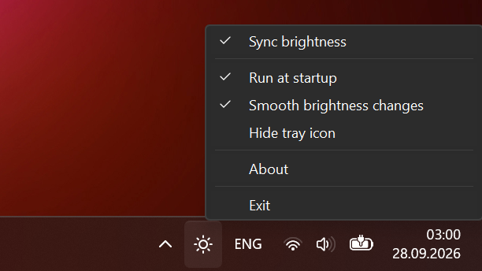
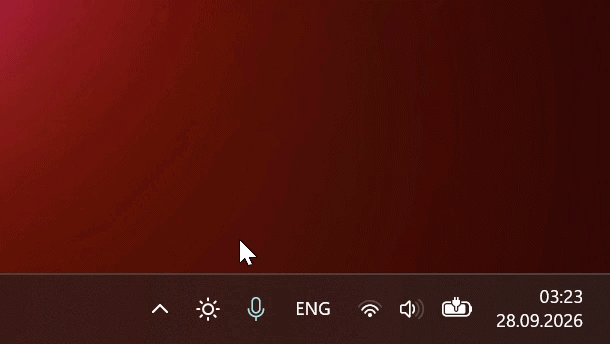

# Brightness Sync

A tiny Windows tray utility that keeps your display brightness the same across all power schemes, so switching power modes no longer changes it.

Bonus: scroll over the tray icon to adjust the brightness.

<p>
   
   
</p>

## The problem

Windows stores display brightness separately for every power scheme. Laptop vendor tools such as ASUS Armoury Crate switch power schemes when you change the operating mode (Silent / Performance / Turbo), and every switch restores that scheme's own brightness. The result: you set 50%, switch to Silent, and the screen jumps to 20%.

Brightness Sync listens for brightness changes and writes the current level into every power scheme, so all modes share one brightness.

## Features

- Brightness stays put when you switch power modes
- Picks up power schemes created later (e.g. after reinstalling Armoury Crate)
- Restores your level if a vendor tool overwrites a scheme's brightness
- Scroll over the tray icon to change the brightness, smoothly or instantly
- Windows 11 style tray icon that shows the brightness level and follows the light or dark taskbar
- Tray menu and About window that follow the Windows theme
- Run at startup without UAC prompts (via Task Scheduler)
- Hidden mode: hide the tray icon, run the app again to bring it back
- Single instance, event-driven (no polling), ~4-8 MB RAM, no dependencies beyond .NET Framework

## Requirements

- Windows 10 or 11
- .NET Framework 4.5 or newer (preinstalled on Windows 10/11)
- A laptop with a built-in display. External monitors are not supported: Windows exposes brightness control over WMI only for internal panels
- Administrator rights (power schemes can only be modified by an admin)

## Install

### winget

```
winget install Yukhnevich.BrightnessSync
```

Then start it: press **Win+R**, type `brightnesssync` and press Enter (or run `brightnesssync` in a terminal).

### Manual

Download `BrightnessSync.exe` from [Releases](https://github.com/Yukhnevich/BrightnessSync/releases) and put it wherever you want to keep it, e.g. `C:\Tools`.

> The exe is not code-signed, so Windows SmartScreen may warn on first launch. Click **More info → Run anyway**, or build it yourself from source.

## Getting started

1. Start the app and confirm the UAC prompt (only needed the first time).
2. Click the sun icon in the tray and enable **Run at startup**.

That's it. From now on it starts at logon with admin rights and no UAC prompt.

### Tray icon

The sun's rays show the current brightness in five steps: all rays are gray below 20%, lit as dots from 20%, and grow with every next 20% until they are full at 80% and above. The ring turns gray while sync is off.

Hover over the icon to see the brightness and the sync state. Scroll over it to change the brightness: one notch moves to the next level your display supports, or by 5% if it supports every percent.

### Tray menu

| Item | Action |
|---|---|
| **Sync brightness** | Keep one brightness in all power schemes. Turn off to let every scheme keep its own brightness again |
| **Run at startup** | Create or remove the scheduled task that starts the app at logon |
| **Smooth brightness changes** | When scrolling, glide through the levels in between. Turn off to jump to the new level instantly |
| **Hide tray icon** | Hide the icon; sync keeps running |
| **About** | Version, tips, the log location and a link to this page |
| **Exit** | Quit the app |

### Launching the app again

Launching the app while it is already running does not start a second copy. Instead, the running instance shows its tray icon and enables sync. This is how you bring back a hidden icon.

If the app is not running and the startup task exists, it starts through the task, without a UAC prompt.

### Command line

| Command | Behavior |
|---|---|
| `brightnesssync` | Show the tray icon and enable sync |
| `brightnesssync /autostart` | Start with saved settings (used by the startup task) |

## Update

Quit the app first (tray → **Exit**), because Windows does not allow replacing a running exe:

```
winget upgrade Yukhnevich.BrightnessSync
```

Then start it again. The startup task keeps working: winget installs every version to the same folder.

## Uninstall

1. Uncheck **Run at startup** in the tray menu, then choose **Exit**.
2. Remove the app: `winget uninstall Yukhnevich.BrightnessSync` (or delete the exe if installed manually).
3. Optionally remove settings and logs:
   ```bat
   reg delete HKCU\Software\BrightnessSync /f
   del "%LOCALAPPDATA%\BrightnessSync.log*"
   ```

Brightness values already written to your power schemes stay equal; this is harmless.

## How it works

- Listens to `WmiMonitorBrightnessEvent` (WMI) for brightness changes from the slider or Fn keys.
- After the slider settles (1 s), writes the level into every power scheme via `PowerWriteACValueIndex` / `PowerWriteDCValueIndex`, for both AC and battery.
- Subscribes to active power scheme changes (`GUID_ACTIVE_POWERSCHEME`). On a switch it re-syncs all schemes, ignores the brightness "echo" of the new scheme, and restores your level if it changed.
- Windows does not send mouse wheel messages to tray icons. While the cursor is over the icon, a low-level mouse hook picks up the wheel; it is removed as soon as the cursor leaves. The brightness is set with `WmiSetBrightness`.
- Waits on events and registry notifications, so it uses no CPU while idle.

## Files and settings

| What | Where |
|---|---|
| Settings | `HKCU\Software\BrightnessSync` (`SyncEnabled`, `TrayVisible`, `SmoothBrightnessChanges`, `ScrollHintSeen`) |
| Log | `%LOCALAPPDATA%\BrightnessSync.log`, rotated to `.log.1` at 64 KB. **About → Open** opens it |
| Startup | Task Scheduler → `BrightnessSync` |

## Troubleshooting

- **Nothing happens / icon stays gray.** Open the log. `Cannot read display brightness via WMI` means the display doesn't support WMI brightness (e.g. a desktop with an external monitor).
- **Brightness still changes in one mode.** Check the log for `Cannot write power scheme` errors; the app must run elevated.
- **Screen dims without the slider moving.** That is not a per-scheme brightness issue but panel/driver power saving: disable *Content adaptive brightness* in Windows display settings, *Display Power Savings* in Intel Graphics Software, or *Vari-Bright* in AMD Software.

## Build from source

No Visual Studio or SDK needed — the C# compiler ships with Windows. Clone the repository and run:

```bat
build.cmd
```

The source is a single file limited to C# 5, so it compiles with the built-in .NET Framework compiler.

## Releasing

1. Bump `AppInfo.Version` in `BrightnessSync.cs`.
2. Push a matching tag, e.g. `git tag v1.1.1 && git push origin v1.1.1`.
3. GitHub Actions builds the exe and publishes a release with its SHA256.
4. Update the winget manifests in [microsoft/winget-pkgs](https://github.com/microsoft/winget-pkgs) (templates are in [`winget/`](winget)).

## License

[MIT](LICENSE) © 2026 [Pavel Yukhnevich](https://github.com/Yukhnevich)
